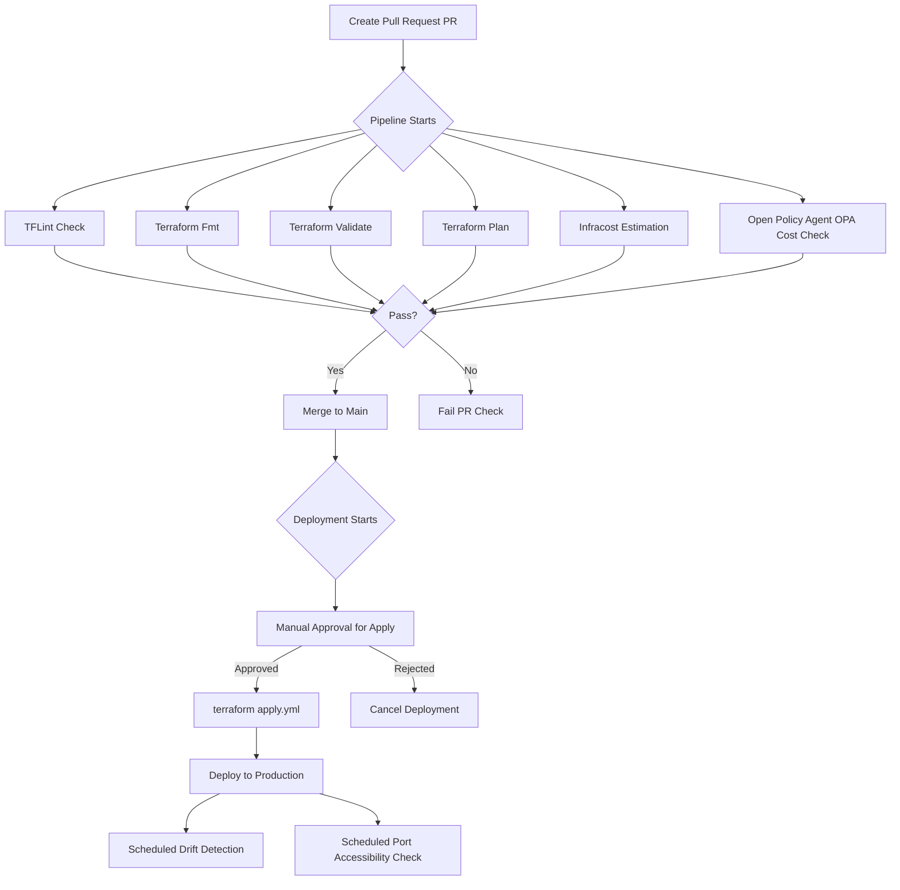

# GitOps with Terraform 2024 MiniCamp

The `README` rubric provides a comprehensive guide to organizing, contributing to, and managing this GitOps project repository for infrastructure provisioning and deployment using Terraform.

---

## 1. Project Overview and Organized Structure
   - **Objective**: Provide a clear purpose for this repository and outline what the project aims to accomplish.
   - **Structure Overview**: Include a detailed breakdown of the repository’s structure:
      - **`bin`**: Houses custom scripts for managing various checks and tools (e.g., `infracost.sh`, `tflint.sh`, `tfsec.sh`).
      - **`cfn`**: Contains AWS CloudFormation configurations for backend and OIDC setup.
      - **`env`**: Stores Python environment configurations.
      - **`policies`**: Holds Open Policy Agent (OPA) `.rego` files to enforce policies.
      - **`terraform`**: Main directory for Terraform configuration files (e.g., `main.tf`, `variables.tf`, `providers.tf`).
      - **`.github/workflows`**: Contains CI/CD workflows (`apply.yml`, `plan.yml`, etc.) for GitHub Actions automation.
   - **Usage Instructions**: Briefly explain the intended use for each of these folders and files to guide contributors.

---

### Cloudformation

The code in the `./cfn` cloudformation templates. It is to configure the OIDC role used to authenticate your GitHub Actions workflows to AWS and also provision backend resources (S3 and Dynamodb) for remote state and state locking. 

This structure within the `cfn` directory is for managing AWS CloudFormation configurations, focusing on backend infrastructure setup and OpenID Connect (OIDC) roles and configurations. Here's a breakdown of each file:

- **`cfn/`**: This directory likely organizes configuration and template files for CloudFormation, which manages AWS infrastructure as code.

  - **`backend-config.toml`**: A configuration file in TOML format, likely defining parameters for backend infrastructure resources (e.g., S3 buckets, DynamoDB tables) that support Terraform state or other backend services.

  - **`backend-resources.yaml`**: A CloudFormation template in YAML format, likely defining the specific AWS resources required for backend operations, such as resource definitions for storage, logging, or other infrastructure components.

  - **`oidc-config.toml`**: This TOML file might store configuration parameters related to OpenID Connect (OIDC) authentication, such as client IDs, endpoints, or scope definitions. It's often used to enable authentication with external identity providers like GitHub or Okta.

  - **`oidc-role.yaml`**: Another CloudFormation template, this one likely defines IAM roles and permissions specific to OIDC-based authentication. It may grant permissions to federated users or applications authenticated via OIDC.

This structure is well-organized for managing backend and security configurations in CloudFormation, with files designated for infrastructure, configuration, and identity management.

### Terraform

The code in the `./terraform` directory is the one with terraform templates for provisioning and deploying infrastructure. 

This structure in the `terraform` directory represents a standard layout for a Terraform configuration, organizing infrastructure code, variable definitions, providers, and outputs. Here’s a brief explanation of each file:

- **`terraform/`**: This directory contains all Terraform files for managing infrastructure-as-code, following common conventions to define resources, variables, and configurations.

  - **`main.tf`**: The primary configuration file where main infrastructure resources are defined. It typically includes resources like VPCs, EC2 instances, IAM roles, or other cloud resources as per the project requirements.

  - **`outputs.tf`**: This file defines output values, which allow information about the infrastructure to be accessible outside the Terraform state. These outputs could include instance IDs, IP addresses, or other resource attributes that may be needed for integrations or to pass data to other Terraform modules.

  - **`providers.tf`**: Specifies the cloud providers (e.g., AWS, Google Cloud) or other services required for the Terraform configuration. It defines provider versions and configurations, establishing a connection to the target environment.

  - **`terraform.tfvars`**: Holds variable values for the Terraform configuration, providing environment-specific data, such as resource names, region settings, or sizes of resources. This file is typically used to set default values for variables defined in `variables.tf`.

  - **`userdata.tftpl`**: A template file written in Terraform’s template language, usually containing user data scripts for configuring instances at runtime (e.g., EC2 instance initialization). It’s commonly used to bootstrap instances with initial settings or software.

  - **`variables.tf`**: Defines all input variables for the Terraform configuration, allowing the flexibility to reuse the configuration across different environments. Variables might include instance types, regions, or any other customizable values.

  - **`versions.tf`**: Specifies the Terraform and provider versions required for the configuration. Setting versions ensures consistency across environments and avoids compatibility issues from version mismatches.

This structure is designed to modularize and organize Terraform configurations, supporting maintainability, scalability, and reusability across different environments.

### Policies

This `policies` directory likely contains [OPA (Open Policy Agent)](https://www.openpolicyagent.org/) policies written in the Rego language, typically used to enforce security, compliance, and best practices for infrastructure as code, such as Terraform. Here’s what each file might represent:

- **`policies/`**: This directory contains policy files that define rules for validating Terraform configurations or cloud resources. The policies ensure infrastructure adheres to security and cost-management guidelines, supporting compliance and governance.

  - **`cost.rego`**: A policy file for cost management. It likely includes rules to monitor and enforce cost-related constraints, such as preventing oversized instances or limiting the creation of expensive resources in certain environments.

  - **`instance-policy.rego`**: This file probably enforces policies specific to compute instances (e.g., AWS EC2 or GCP VM instances). Rules here could include restrictions on instance types, enforcing tagging standards, or ensuring instances are launched with appropriate security settings.

  - **`plan.rego`**: This file may contain policies for validating Terraform plans before they are applied. It can be used to analyze and enforce specific constraints or best practices at the planning stage, preventing misconfigurations or policy violations before resources are deployed.

These `.rego` files help establish guardrails for infrastructure management, ensuring configurations are compliant, cost-effective, and secure across deployments.

### Bin

The `bin` directory structure represents a typical setup for infrastructure management and DevOps tooling scripts, likely used in a project involving Infrastructure as Code (IaC) with Terraform and related tools. Here's a brief breakdown:

- **`bin/`**: This directory commonly holds executable scripts and utilities. By convention, it's where helper scripts, shell scripts, or binaries related to the project are stored for easy access.

  - **`cfn`**: This file could relate to AWS CloudFormation, potentially containing commands or scripts to manage or validate CloudFormation templates.

  - **`infracost.sh`**: Likely a script to run [Infracost](https://www.infracost.io/), a tool for estimating the cost of Terraform projects, allowing users to calculate and monitor infrastructure costs.

  - **`pre-commit-setup.sh`**: This script might configure [pre-commit](https://pre-commit.com/), a tool to manage Git pre-commit hooks for code checks. It's often used to automatically format or validate code before committing.

  - **`terraform.sh`**: Typically used to wrap or manage Terraform commands, such as `apply`, `plan`, or `destroy`, possibly providing additional options or logging.

  - **`terrascan.sh`**: A script likely used to run [Terrascan](https://runterrascan.io/), which scans Terraform code for security issues and misconfigurations.

  - **`tflint.sh`**: Likely executes [TFLint](https://github.com/terraform-linters/tflint), a linter for Terraform code to enforce best practices and catch syntax errors.

  - **`tfsec.sh`**: A script that probably runs [TFSec](https://aquasecurity.github.io/tfsec/), another tool for scanning Terraform code for security vulnerabilities.

Together, these scripts automate setup, cost estimation, linting, and security checks, streamlining the development and validation process for Terraform-based infrastructure code.

## 2. CI/CD Workflow Descriptions:

The `.github/workflows` directory contains GitHub Actions workflow configuration files in YAML format. These files define automated workflows for infrastructure management tasks, likely triggered by events such as pull requests or commits to specific branches. Here’s a breakdown of each workflow:

- **`.github/workflows/`**: This directory holds GitHub Actions workflows that automate CI/CD processes for Terraform and infrastructure-related tasks.

  - **`apply.yml`**: Automates the `terraform apply` command, which applies changes to the infrastructure. This workflow might run after a successful `plan` step and could be restricted to certain branches or environments, like `main` or `production`.

  - **`destroy.yml`**: Defines a workflow to run `terraform destroy`, which deletes infrastructure resources. This workflow is usually triggered manually or in sandbox/staging environments where temporary resources are created.

  - **`drift.yml`**: Checks for drift in the infrastructure, which happens when the actual state of resources differs from the expected Terraform state. It might use tools like `terraform plan` or specialized drift-detection tools to identify unintended changes. See [Github Actions Schedule](https://docs.github.com/en/actions/writing-workflows/choosing-when-your-workflow-runs/events-that-trigger-workflows#schedule).

  - **`infracost.yml`**: Runs [Infracost](https://www.infracost.io/) to estimate and report on the cost of infrastructure changes proposed in a pull request. This helps teams understand cost impacts before applying changes.

  - **`infracost.yml.example`**: A template for setting up `infracost.yml`, providing an example configuration that might include placeholders for project-specific settings or secrets.

  - **`plan.yml`**: Automates the `terraform plan` command, which previews infrastructure changes without applying them. This workflow often runs on pull requests to show potential changes to reviewers, enabling early feedback and validation.

  - **`terraform.yml`**: A general workflow for managing Terraform-related tasks, potentially consolidating multiple Terraform commands (e.g., `init`, `validate`, `fmt`) to ensure code quality, syntax checks, and state initialization.

  - **`tflint.yml`**: Runs [TFLint](https://github.com/terraform-linters/tflint), a linter that checks Terraform configurations for best practices, potential issues, and style consistency. It’s typically used to enforce code standards and catch errors early.

These workflows automate critical parts of the infrastructure deployment lifecycle, enabling continuous integration, cost monitoring, security checks, and compliance for Terraform configurations.

   - **Branch Protection and Checks**:
      - Describe the protected `main` branch rules: no direct merging, all workflows and checks must pass before merging.
      - Note the specific checks required, such as `terraform fmt`, `validate`, `Infracost`, and OPA checks.


#### Workflow Architecture Diagram


---

## 3. Contribution Instructions
### CloudFormation Command Line Interface (CFN-CLI) and Prerequisites
- [**What is the CloudFormation Command Line Interface (CFN-CLI)?**](https://docs.aws.amazon.com/cloudformation-cli/latest/userguide/what-is-cloudformation-cli.html)

#### Install
To install the CFN-CLI run the command below

```sh
pip install cloudformation-cli cloudformation-cli-java-plugin cloudformation-cli-go-plugin cloudformation-cli-python-plugin cloudformation-cli-typescript-plugin
```
For a specific OS follow the instructions [**here**](https://docs.aws.amazon.com/cloudformation-cli/latest/userguide/what-is-cloudformation-cli.html)

### CFN-Toml
Toml Configuration for Bash scripts using CloudFormation library created by [**Andrew Brown**](https://github.com/omenking) written in Ruby.
This will allow us to pull in external parameters as variables within our deploy scripts, then pass them during creation from our CFN templates. These values are normally hardcoded into the script/command to deploy the CFN template, but with Andrew's library this won't be necessary.

Go to Andrew's public repo for cfn-toml here: https://github.com/teacherseat/cfn-toml/tree/main and we walk through how to use it. We begin by installing cfn-toml through the CLI:

```sh
gem install cfn-toml
```

Extracting environment variables and parsing parameter configurations using [TOML](https://www.w3schools.io/file/toml-introduction/) for cloudformation templates.

### AWS Configuration

#### Getting the AWS CLI Working

After activating your AWS account, proceed to make AWS CLI working both on your local machine environment following the steps below.

#### Install AWS CLI

Run the commands indivually to perform the install manually

```sh
cd ~/
curl "https://awscli.amazonaws.com/awscli-exe-linux-x86_64.zip" -o "awscliv2.zip"
unzip awscliv2.zip
sudo ./aws/install
cd -
```

#### Create a new User and Generate AWS Credentials

- Go to  [IAM Users Console](https://us-east-1.console.aws.amazon.com/iamv2/home?region=us-east-1#/users) and created a new user
- I enabled console access for the user
- I created a new Admin Group and apply AdministratorAccess
- I created the user and go find and click into the user
- Click on Security Credentials and Create Access Key
- Choose AWS CLI Access
- Download the CSV with the credentials

#### Set Env Vars
I set these credentials for the current bash terminal

```sh
export AWS_ACCESS_KEY_ID="<YOUR_AWS_ACCESS_KEY_ID>"
export AWS_SECRET_ACCESS_KEY="<YOUR_AWS_SECRET_ACCESS_KEY>"
export AWS_DEFAULT_REGION="<YOUR_AWS_DEFAULT_REGION>"
```

See example below

```sh
export AWS_ACCESS_KEY_ID="AKIAWXXXXXXXXXXX"
export AWS_SECRET_ACCESS_KEY="Rw7Ah1X5fXXXXXXXXXXXXXXXXXXXXXXXXXXX"
export AWS_DEFAULT_REGION="us-east-1"
```

You can check that the AWS CLI is working and you are the expected user

```sh
aws sts get-caller-identity
```

You should see something like this:

```json
{
    "UserId": "AIDAW5ZUFARLXXXXXXXX",
    "Account": "47631387XXXXXXXX",
    "Arn": "arn:aws:iam::47631387XXXXXXXX:user/patrickcmd"
}
```

To setup OIDC role, S3 for remote state, Dynamodb for state locking run the commands below.

```sh
chmod u+x bin/cfn/*
./bin/cfn/oidc-role-deploy
./bin/cfn/backend-deploy
```

This deploys the cloudformation templates for oidc role and S3 and dynamodb backend resources but doesn't execute the changesets, they are left for manual review by the user. Login into your AWS account, search clloudformation, review and execute the changesets to complete with the deployment.

### Terraform
#### Install Terraform CLI
To setupp and install the [Terraform CLI](https://developer.hashicorp.com/terraform/install) follow the instructions [here](https://developer.hashicorp.com/terraform/install) for the different OS environments.

For linux you can just the bash script with the commands below;

```sh
chmod u+x bin/*
./bin/terraform.sh
```

### Pre-commit Hooks
- For the general pre-commit setup and install see instructions [here](https://pre-commit.com/#install)
- For this project we use the [pre-commit-terraform](https://github.com/antonbabenko/pre-commit-terraform) to setup pre-commit git hooks to take care of Terraform configurations

See the `pre-commit-config` file [here](./.pre-commit-config.yaml)

When you a git commit command, the pre-commit has to pass first before the changes are successfully committed.

```
Terraform fmt........................................(no files to check)Skipped
Terraform validate...................................(no files to check)Skipped
Terraform validate with tflint.......................(no files to check)Skipped
Terraform validate with trivy........................(no files to check)Skipped
On branch readme-rubric
nothing to commit, working tree clean
```

### Pull Request Requirements
- All pull requests must pass the CI/CD pipeline checks, including `terraform fmt`, `validate`, `plan`, and `Infracost`.
- Include steps to address potential failed checks in pull requests.

- **Policy Compliance**:
    - Describe Open Policy Agent (OPA) enforcement policies, such as failing if cost > $10.
    - Provide guidelines for cost review and modification of policies if necessary.

---

## 4. Explains Merging Strategy
   - **Branch Strategy**:
      - Use feature branches for development; merge to `main` only after successful PR review and pipeline checks.
      - Describe GitFlow or an alternative branching strategy to manage feature, release, and hotfix branches.
   - **Protected Main Branch**:
      - Reinforce that `main` is a protected branch, ensuring only approved and tested code reaches production.
      - Merging requires passing all checks; no direct commits to `main` are allowed.
   - **Human Intervention for `terraform apply`**:
      - Emphasize that `apply.yml` requires manual approval for production changes.
      - Describe the process for obtaining approvals, particularly for high-risk infrastructure changes.

---

## 5. Reference Documentations:
- **Terraform**: Link to the official [Terraform documentation](https://www.terraform.io/docs/).
    - [Terraform Checks](https://developer.hashicorp.com/terraform/language/checks)
    - [Terraform S3 Backend](https://developer.hashicorp.com/terraform/language/backend/s3)
    - [Terrateam](https://docs.terrateam.io/)
    - [Marika's blog](https://blog.marikabergman.com/designing-a-gitops-pipeline-for-aws-and-terraform)
    - [Terraform with GitHub Actions : How to Manage & Scale - Blog](https://spacelift.io/blog/github-actions-terraform)
    - [OpenTofu](https://opentofu.org/)
- **TFLint**: [TFLint documentation](https://github.com/terraform-linters/tflint).
- **Infracost**: [Infracost documentation](https://www.infracost.io/docs/).
    - [OPA](https://www.infracost.io/docs/integrations/open_policy_agent/)
    - [Infracost Github](https://github.com/infracost/infracost)
    - [Infracost Github Actions](https://github.com/infracost/actions)
- **OPA**: Link to Open Policy Agent’s [policy guide](https://www.openpolicyagent.org/docs/latest/).
    - [OPA Terraform](https://www.openpolicyagent.org/docs/latest/terraform/)
    - [OPA Terraform Getting Started](https://github.com/open-policy-agent/opa/blob/main/docs/content/terraform.md)
- **Github Actions**
    - [Github Actions Schedule](https://docs.github.com/en/actions/writing-workflows/choosing-when-your-workflow-runs/events-that-trigger-workflows#schedule)
    - [Manually running a workflow](https://docs.github.com/en/actions/managing-workflow-runs-and-deployments/managing-workflow-runs/manually-running-a-workflow)
    - [Manual Workflow Approval](https://github.com/trstringer/manual-approval)
    - [Configuring OpenID Connect in Amazon Web Services](https://docs.github.com/en/actions/security-for-github-actions/security-hardening-your-deployments/configuring-openid-connect-in-amazon-web-services)
    - [Configure AWS Credentials for GitHub Actions](https://github.com/aws-actions/configure-aws-credentials/tree/v2/)
    - [Automate Terraform with GitHub Actions](https://developer.hashicorp.com/terraform/tutorials/automation/github-actions)
    - [Set up Terraform CLI in your GitHub Actions workflow](https://github.com/hashicorp/setup-terraform)
    - [Automate AWS deployments with HCP Terraform and GitHub Actions - Blog](https://www.hashicorp.com/blog/automate-aws-deployments-with-hcp-terraform-and-github-actions)
    - [How to: Deploy Terraform to AWS with GitHub Actions authenticated with OpenID Connect - Blog](https://xebia.com/blog/how-to-deploy-terraform-to-aws-with-github-actions-authenticated-with-openid-connect/)
- **Pre-coomit hooks**
    - [Docummentation](https://pre-commit.com/index.html)
    - [Pre commit terraform](https://github.com/antonbabenko/pre-commit-terraform)
    - [How to terraform pre-commit hooks](https://terraform-docs.io/how-to/pre-commit-hooks/)

---

